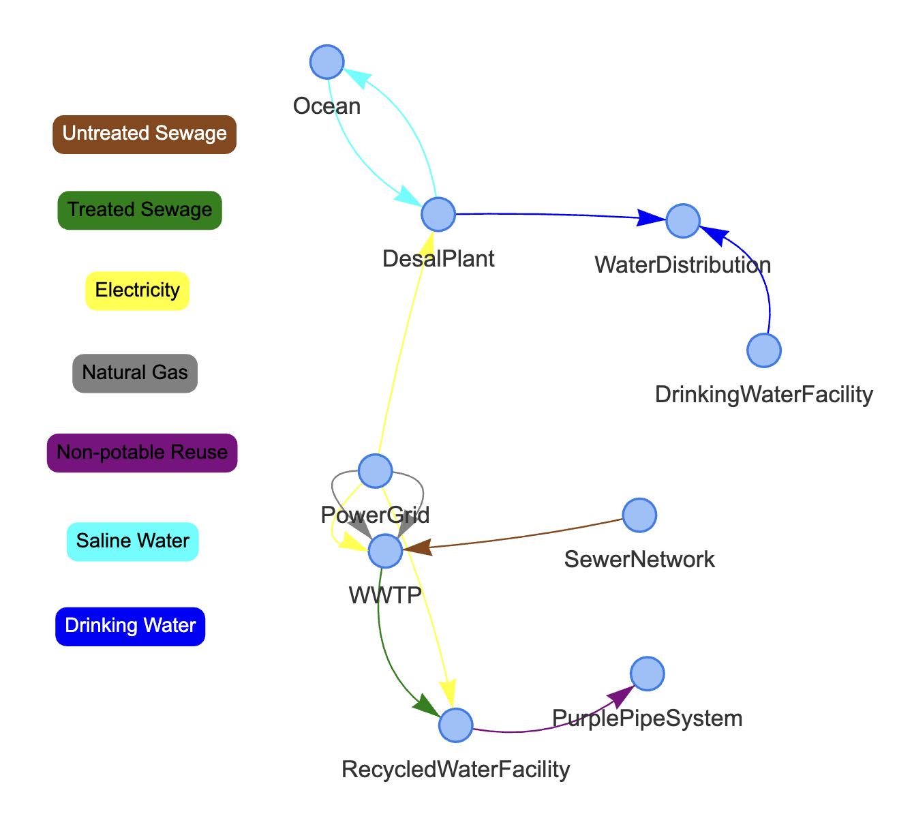
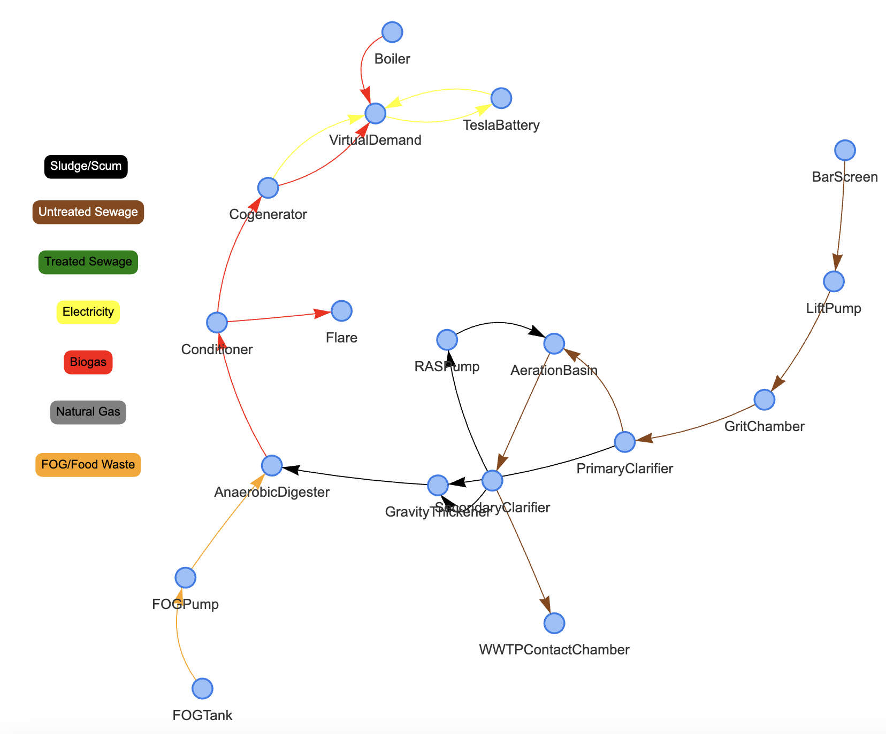
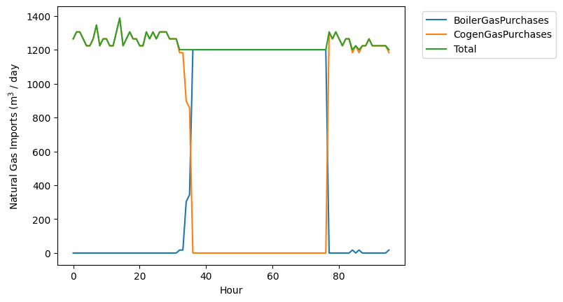

.. contents::

.. _helloworld:

***************
Getting Started
***************

Loading a PyPES Model
=====================

For most users, the first step to using PyPES will be to pip install the Python package:

.. code-block:: python

    pip install pype-schema

This installation should come with two sample facility configurations: 
one for water resource recovery (`wrrf_sample.json`) and one for desalination (`desal_sample.json`). 
To load the water resource recovery facility (WRRF) example, run the following code from the `pype_schema/data` folder:

.. code-block:: python

    from pype_schema.parse_json import JSONParser

    parser = JSONParser("wrrf_sample.json")
    network = parser.initialize_network()

.. _model_struct:

Model Structure
===============

The :ref:`visualize` module can be used to view the loaded PyPES representation with either of the ``pyvis`` or ``networkx`` packages.

.. code-block:: python
    
    from pype_schema.visualize import draw_graph
    
    pyvis = True
    draw_graph(network, pyvis)

Running the above code should produce the following HTML visualization:

PyPES models can have nodes nested within nodes. 
For example, the `WWTP` node nested inside the top-level network can be visualized as follows:

.. code-block:: python
        
    node_id = "WWTP"
    draw_graph(network.get_node(node_id), pyvis)

Now, let's discuss some of the components of the graph.

Connection
**********

Conceptually, connections are objects in a WRRF that act as a vector to transport contents from a source to a destination. 

In practice, there will be an abstract Python class ``Connection`` with two subclasses: ``Pipe`` and ``Wire``. :ref:`conn_rep` contains tables with 
required attributes (e.g., source, destination) and optional attributes of those classes (e.g., diameter, contents). 
All ``Connection`` objects have a dictionary of tags with the tag IDs as keys and ``Tag`` or ``VirtualTag`` objects as values.

Node
****
Conceptually, nodes are objects that represent a wide variety of entities, from clarifiers, aerators, and filters for treatment to batteries, pumps, and cogenerators for energy modeling.

In practice, there will be an abstract Python class ``Node`` with many subclasses. :ref:`node_rep` contains tables with all the potential node classes (e..g, ``Tank``, ``Filtration``, ``Battery``, etc.), r
equired attributes of those classes (e.g., id, contents), and optional attributes of those classes (e.g., volume, contents). 
All ``Node`` objects have a dictionary of tags with the tag IDs as keys and ``Tag`` or ``VirtualTag`` objects as values.

Tag
***

Conceptually, tags are sensors that collect WRRF data, such as flow rate or temperature. 
They are not a part of the graph like nodes or connections, but are associated with nodes and connections along with other attributes.

Each ``Tag`` object contains attributes related to data being collected, such as the string ID, type of measurement, and units 
(see :ref:`tag_rep` for more details).

.. _mod_model:

Modifying the Model
===================

The graphical representation of the facility can be modified programmatically. 
This can be useful for modeling upgrades to existing infrastructure by seamlessly comparing two configurations side-by-side.

For example, to add a 10,000 gallon storage tank at 1,000 meters elevation to the water distribution network:

.. code-block:: python

    from pype_schema.node import Tank
    from pype_schema.utils import parse_quantity, ContentsType

    volume = parse_quantity(10000, "gal")
    elevation = parse_quantity(1000, "m")

    # create the battery node
    tank = Tank(
        "StorageTank", 
        ContentsType.DrinkingWater, 
        ContentsType.DrinkingWater, 
        elevation, 
        volume
    )

    # add the node to the facility
    wds = network.get_node("WaterDistribution")
    wds.add_node(tank)

Now that there is a node inside the water distribution network, the connection can be modified to have an 
``entry_point``. The ``entry_point`` and ``exit_point`` attributes allow a user to specify the subnode to which 
a connection is starting or ending at when the connection goes between levels in the graph. For example, in this
case we want to specify that the drinking water treatment plant effluent goes not only to the water distribution
network, but to a specific storage tank within the distribution network:

.. code-block:: python

    from pype_schema.connection import Connection

    wds_conn = network.select_objs(
        source_id="DrinkingWaterFacility",
        dest_id="WaterDistribution",
        obj_type=Connection
    )[0]
    wds_conn.entry_point = tank

The next section, :ref:`query_model`, explains querying using ``select_objs`` in further detail.

Rather than adding components to the model one-by-one in Python, 
a user can edit the JSON file directly and then re-load the model (see :ref:`json_rep`) 

.. _query_model:

Querying the Model
==================

PyPES offers built-in search capabilities that allow users to find nodes, connections, and tags
matching desired characteristics.

Modeling applications can be generalized through the use of these queries. For example, to calculate the 
natural gas purchases at a facility without knowing how many boilers or cogenerators (if any) exist, a user
could query for all connections with ``ContentsType`` are ``NaturalGas`` entering the ``WWTP`` node:

.. code-block:: python

    ng_conns = network.select_objs(
        dest_id="WWTP",
        contents_type=ContentsType.NaturalGas,
        obj_type=Connection,
        recurse=True
    )

Its often more convenient to get all the tags directly. Then, if the data is in CSV format the tags correspond to
column names that can be operated on:

.. code-block:: python

    from pype_schema.tag import Tag
    import pandas as pd

    df = pd.read_csv("sample_data.csv")

    ng_tags = network.select_objs(
        dest_id="WWTP",
        contents_type=ContentsType.NaturalGas,
        obj_type=Tag,
        recurse=True
    )

    ng_tag_ids = [tag.id for tag in ng_tags]
    ng_import_timeseries = df[ng_tag_ids].sum(axis=1)

Then, ``ng_import_timeseries`` could be used for whatever application the user desires. 
For example, to plot the natural gas imports over time:

.. code-block:: python

    import matplotlib.pyplot as plt

    for tag in ng_tags:
        plt.plot(df[tag.id], label=tag.id)

    plt.plot(ng_import_timeseries, label="TotalGasPurchases")
    plt.xlabel("Hour")
    plt.ylabel("Natural Gas Imports (m$^3$ / day)")
    plt.legend(loc='upper right', bbox_to_anchor=(1.45, 1.0))
    plt.savefig("ng-imports.png", bbox_inches="tight")

Unit IDs are used to specify identical parallel processes. 
For example, a cogenerator may have two engines. 
Therefore, ``dest_unit_id`` was specified as `"total"` because there may be unit-level tags, 
and summing both unit-level and total tags would lead to overcounting.

There are a number of optional arguments to ``select_objs``, most of which default to ``None``. The function is 
fully documented in `node.Node.select_objs <https://we3lab.github.io/pype-schema/node.html#pype_schema.node.Node.select_objs>`_.